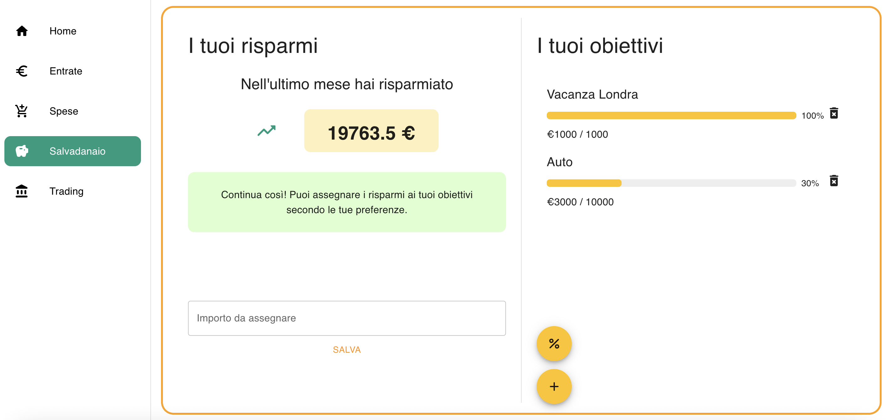

# AssetFlow

Tool for personal finance with frontend in React and backend in NodeJS.

## Sections

### Home
Shows the total amount of incomes and expenses.

### Incomes & Expenses
Show respectively the incomes and the expenses of the last month or the last year.

### Moneybox
Divided into two subsections.
On the left you can see the total savings. 
If this value is positive, you can allocate a certain percentage of it in one of the savings goals shown on the right.

### Trading
Keeps track of the live prices of stocks that the user wants to keep track of.
Data comes from Yahoo Finance. 
The graph on the left shows the way prices changed in the last 30 days.

## Screenshots

### Home

### Incomes

### Moneybox

### Trading
